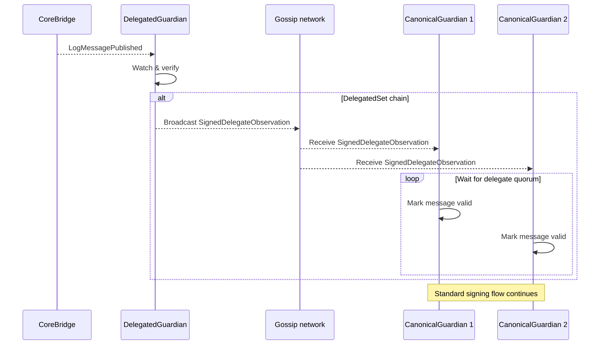

# Guardians

Wormhole relies on a set of {{ guardian_count }} distributed nodes called Guardians that monitor the state on several blockchains. The current Guardian set can be seen in the [Dashboard](https://wormhole-foundation.github.io/wormhole-dashboard/#/?endpoint=Mainnet){target=\_blank}. Depending on the chain's operational configuration, messages may be observed directly by all Guardians or by a delegated subset of Guardians. Regardless of how observations are collected, all [Verifiable Action Approvals](/docs/protocol/infrastructure/vaas/){target=\_blank} (VAAs) are ultimately produced as standard {{ guardian_quorum }}-of-{{ guardian_count }} multisignature attestations, preserving full compatibility with existing contracts and integrators.

Guardians fulfill their role in the messaging protocol as follows:

1. Guardians observe messages and sign the corresponding payloads in isolation from the other Guardians.
    - On chains where all Guardians perform direct on-chain observation, each Guardian independently observes events directly.
    - On delegated chains, a subset performs direct observation and broadcasts a `DelegateObservation` to the rest of the network.
2. Once a sufficient delegate quorum is reached or once Guardians independently observe the event, signatures accumulate until the required {{ guardian_quorum }}-of-{{ guardian_count }} quorum is achieved.
3. This multisig represents proof that a majority of the Wormhole network has observed and agreed upon a state.

## Guardian Sets and Delegation

The Guardian network comprises {{ guardian_count }} Guardians. However, some chains may utilize delegated subsets. Some chains (such as Ethereum and Solana) are secured by all {{ guardian_count }} Guardians. Each Guardian runs a full node and independently observes on-chain events. Other chains may be secured by a delegated subset of Guardians based on chain activity. Chains that are not explicitly delegated, default to full Guardian Set observation, meaning all {{ guardian_count }} Guardians observe directly.

For these chains:

- A configured delegated subset of the {{ guardian_count }} Guardians performs direct on-chain observation.
- Delegated Guardians broadcast a `SignedDelegateObservation` gossip message.
- Canonical Guardians wait until a delegate quorum is reached before signing.
- A standard {{ guardian_quorum }}-of-{{ guardian_count }} VAA is ultimately produced.

This design provides operational flexibility while maintaining compatibility with the existing Wormhole contract stack.

### Delegated Observation Flow

The following flow shows how a subset of Guardians directly observes events on those chains and broadcasts a `SignedDelegateObservation` message over the Guardian gossip network. Canonical Guardians wait until the configured delegate quorum is reached before proceeding with the normal signing process. The final result is still a standard {{ guardian_quorum }}-of-{{ guardian_count }} VAA, fully compatible with existing smart contracts and integrations.

### Delegate Quorum Safeguards

On delegated chains, Canonical Guardians will not sign a message until a delegate quorum has been reached. This prevents a minority of Delegated Guardians from lowering the effective security threshold of a chain. For example, if a chain is configured as 7-of-9 Delegated Guardians, Canonical Guardians will only sign after at least 7 delegate observations agree. Once a delegate quorum is satisfied, Canonical Guardians sign to produce a standard {{ guardian_quorum }}-of-{{ guardian_count }} VAA.

## Guardian Network

The Guardian Network functions as Wormhole's decentralized oracle, ensuring secure, cross-chain interoperability. Learning about this critical element of the Wormhole ecosystem will help you better understand the protocol.

The Guardian Network is designed to help Wormhole deliver on five key principles:

- **Decentralization**: Control of the network is distributed across many parties.
- **Modularity**: Independent components (e.g., oracle, relayer, applications) ensure flexibility and upgradeability.
- **Chain agnosticism**: Supports EVM, Solana, and other blockchains without relying on a single network.
- **Scalability**: Can handle large transaction volumes and high-value transfers.
- **Upgradeable**: Can change the implementation of its existing modules without breaking integrators to adapt to changes in decentralized computing.

The following sections explore each principle in detail.

### Decentralization

Decentralization remains the core concern for interoperability protocols. Earlier solutions were fully centralized, and even newer models often rely on a single entity or just one or two actors, creating low thresholds for collusion or failure.

Two common approaches to decentralization have notable limitations:

- **Proof-of-Stake (PoS)**: While PoS is often seen as a go-to model for decentralization, it is not well-suited for a network that verifies many blockchains and does not run its own smart contracts. Its security in this context is unproven, and it introduces complexities that make other design goals harder to achieve.
- **Zero-Knowledge Proofs (ZKPs)**: ZKPs offer a trustless and decentralized approach, but the technology is still early-stage. On-chain verification is often too computationally expensive—especially on less capable chains—so a multisig-based fallback is still required for practical deployment.

In the current DeFi landscape, most major blockchains are secured by a small group of validator companies. Only a limited number of companies worldwide have the expertise and capital to run high-performance validators.

If a protocol could unite many of these top validator companies into a purpose-built consensus mechanism designed for interoperability, it would likely offer better performance and security than a token-incentivized network. The key question is: how many of them could Wormhole realistically involve?

To answer that, consider these key constraints and design decisions:

- **Threshold signatures allow flexibility, but**: With threshold signatures, in theory, any number of validators could participate. However, threshold signatures are not yet widely supported across blockchains. Verifying them is expensive and complex, especially in a chain-agnostic system.
- **t-Schnorr multisig is more practical**: Wormhole uses [t-Schnorr multisig](https://en.wikipedia.org/wiki/Schnorr_signature){target=\_blank}, which is broadly supported and relatively inexpensive to verify. However, verification costs scale linearly with the number of signers, so the size of the validator set needs to be deliberately specified.
- **{{ guardian_count }} Guardians form the canonical set**: A set of {{ guardian_count }} participants presents ample opportunity for both decentralization and efficiency. A quorum of {{ guardian_quorum }} signatures is required to produce a valid VAA.
- **Per-chain delegated thresholds**: On delegated chains, a delegated subset of Guardians may be configured with an optimized observation threshold. Canonical Guardians wait for delegate quorum before contributing their signatures, ensuring that the effective security threshold for a chain cannot be reduced below its configured level.
- **Security through reputation, not tokens**: Wormhole relies on a network of established validator companies instead of token-based incentives. These {{ guardian_count }} Guardians are among the most trusted operators in the industry — real entities with a track record, not anonymous participants.

This forms the foundation for a purpose-built Proof-of-Authority (PoA) consensus model, where each Guardian has an equal stake. As threshold signatures gain broader support, the set can expand. Once ZKPs become widely viable, the network can evolve into a fully trustless system.

### Modularity

Wormhole is designed with simple components that are very good at a single function. Separating security and consensus (Guardians) from message delivery ([Executor](/docs/protocol/infrastructure/relayers/executor-framework/){target=\_blank}) allows for the flexibility to change or upgrade one component without disrupting the others.

### Chain Agnosticism

Today, Wormhole supports a broader range of ecosystems than any other interoperability protocol because it uses simple tech (t-schnorr signatures), an adaptable, heterogeneous relayer model, and a robust validator network. Wormhole can expand to new ecosystems as quickly as a [Core Contract](/docs/protocol/infrastructure/core-contracts/){target=\_blank} can be developed for the smart contract runtime.

### Scalability

Wormhole scales well, as demonstrated by its ability to handle substantial total value locked (TVL) and transaction volume even during tumultuous events.

On chains where all Guardians perform direct on-chain observation, each Guardian runs a full node and independently observes events. This requirement can be computationally heavy to set up; however, once all the full nodes are running, the Guardian Network's actual computation needs become lightweight.

On delegated chains, only the delegated subset of Guardians runs full nodes. Canonical Guardians rely on delegate observations broadcast through the gossip network and wait for delegate quorum before signing.

This reduces operational overhead while preserving the security model of the network. Performance is generally limited by the speed of the underlying blockchains, not the Guardian Network itself.

### Upgradeable

Wormhole is designed to adapt and evolve in the following ways:

- **Per-chain security configuration**: The Delegated Guardian configuration is managed via governance through the `WormholeDelegatedGuardians` contract, allowing per-chain threshold adjustments without requiring upgrades to existing Core contracts.
- **Guardian Set expansion**: Future updates may introduce threshold signatures to allow for more Guardians in the set.
- **ZKP integration**: As Zero-Knowledge Proofs become more widely supported, the network can transition to a fully trustless model.

These principles combine to create a clear pathway towards a fully trustless interoperability layer that spans decentralized computing.

## Next Steps

-   :octicons-book-16:{ .lg .middle } **Executor**

    ---

    Learn about the Executor framework - a shared, permissionless system for executing cross-chain messages using standardized contracts and quotes.

    [:custom-arrow: Learn About Executor](/docs/protocol/infrastructure/relayers/executor-framework/)

-   :octicons-tools-16:{ .lg .middle } **Query Guardian Data**

    ---

    Learn how to use Wormhole Queries to add real-time access to Guardian-attested on-chain data via a REST endpoint to your dApp, enabling secure cross-chain interactions and verifications.

    [:custom-arrow: Build with Queries](/docs/products/queries/overview/)

-   :octicons-tools-16:{ .lg .middle } **Wormhole Dev Arena**

    ---

    A structured learning hub with hands-on tutorials across the Wormhole ecosystem.

    [:custom-arrow: Explore the Dev Arena](https://arena.wormhole.com/ecosystem){target=\_blank}

