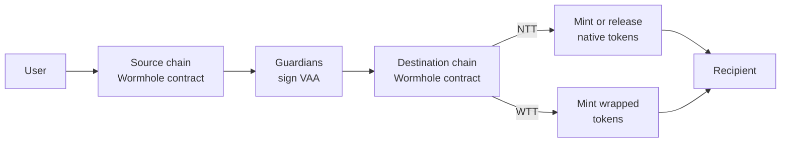

## Token Transfers Overview

Wormhole Token Transfers let you move assets seamlessly across chains. Developers can choose between [Native Token Transfers (NTT)](/docs/products/token-transfers/native-token-transfers/overview/){target=\_blank}, which enable direct movement of native tokens, or [Wrapped Token Transfers (WTT)](/docs/products/token-transfers/wrapped-token-transfers/overview/){target=\_blank}, which use a lock-and-mint model for broad compatibility. Both approaches are secured by the Wormhole [Guardians](/docs/protocol/infrastructure/guardians/){target=\_blank} and integrate with the same cross-chain messaging layer.

## How Token Transfers Work

Both NTT and WTT rely on Guardian-signed messages ([VAAs](/docs/protocol/infrastructure/vaas/){target=\_blank}) to move tokens securely across chains. The difference lies in how tokens are represented on the destination chain.

At a high level, the flow looks like this:

1. A user sends tokens to the Wormhole contract on the source chain.
2. The contract emits a message, which is signed by the Guardians as a VAA.
3. The VAA is submitted to the destination chain.
4. Depending on the transfer type:
    - **NTT**: Tokens are minted or released from escrow.
    - **WTT**: Wrapped tokens are minted to the recipient’s wallet.

## Choosing Between NTT and WTT

| Feature                  | NTT (Native Token Transfers)                                        | WTT (Wrapped Token Transfers)                                 |
| ------------------------ | ------------------------------------------------------------------- | ------------------------------------------------------------- |
| **Token Representation** | Maintains the same token across chains                              | Creates a new wrapped version on the destination chain        |
| **Contract Ownership**   | Requires projects to deploy and manage their own transfer contracts | Contracts are owned and managed by Wormhole                   |
| **Setup Effort**         | Higher (deploy contracts, configure relayers)                       | Lower (no custom contracts required)                          |
| **User Experience**      | Seamless, users interact with the same token everywhere            | Wrapped assets may need explorer metadata updates for clarity |
| **Best For**             | Projects that want full control of their cross-chain token          | Projects that want a fast, managed bridging solution          |

!!! note "Terminology"
    In the SDK and smart contracts, Wrapped Token Transfers (WTT) are referred to as Token Bridge. In documentation, we use WTT for clarity. Both terms describe the same protocol.

## Next Steps

If you are looking for more guided practice, take a look at:

- **[Get Started with NTT](/docs/products/token-transfers/native-token-transfers/get-started/){target=\_blank}**: Learn how to deploy and register contracts to transfer native tokens across chains.
- **[Get Started with WTT](/docs/products/token-transfers/wrapped-token-transfers/get-started/){target=\_blank}**: Perform token transfers using WTT, including manual and automatic transfers.