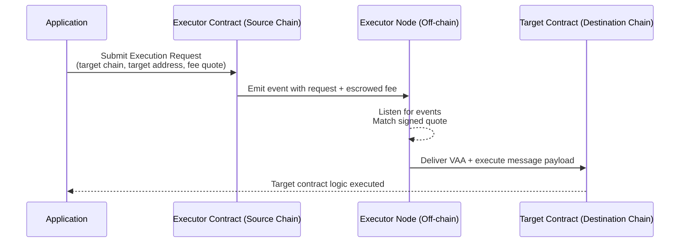

# Relayers

This page provides a comprehensive guide to relayers within the Wormhole network, describing their role, types, and benefits in facilitating multichain processes.

Relaying refers to the process of delivering a cross-chain message, specifically a [Verified Action Approval (VAA)](/docs/protocol/infrastructure/vaas/){target=\_blank}, from its source chain to the destination chain. In a multichain application, after a message is emitted on the source chain and signed by Wormhole’s Guardians, it must be carried over to the target chain’s contract – this is the relayer's responsibility. 

Relayers do not need to be trusted; the security of Wormhole messages stems from the Guardian Network signatures on the VAA, which cannot be tampered with by relayers. In other words, a relayer cannot alter the content or outcome of a message – it can only affect when the message gets delivered (availability). This trust-minimized design means developers and users don’t have to trust a relayer service to preserve integrity, only to be online to forward the message.

## Fundamentals

This section highlights the crucial principles underpinning the operation and handling of relayers within the Wormhole network.

Relayers are fundamentally trustless entities within the network, meaning while they don't require your trust to operate, you also shouldn't trust them implicitly. They function as delivery mechanisms, transporting VAAs from their source to their destination.

- **Anyone can relay a message**: Guardians broadcast signed VAAs publicly, so any entity can retrieve a VAA and submit it to the destination chain’s contracts. The signatures provide universal verifiability; any Wormhole contract or client can check the Guardian signatures. These properties ensure that relaying can be permissionless and trustless. If one relayer is down, any other party (even the user) could take the VAA and deliver it. No relayer can forge or modify the message without invalidating the signatures.
- **Security is in the VAA**: The Wormhole Guardians’ signatures authenticate the message. A relayer might provide additional info or off-chain data, but contracts should not rely on anything that isn’t from a verified VAA or on-chain source. This ensures that even though relayers operate off-chain, they cannot compromise the application’s logic or funds. In summary, Wormhole relayers can’t compromise security, only availability – if a relayer misbehaves, the worst outcome is a delayed or missed delivery, not a falsified message.
- **User experience vs. infrastructure**: Relayers exist to improve user experience by automating cross-chain steps that would otherwise be manual. However, using relayers introduces considerations around fees and infrastructure. Developers must either rely on an external relayer service or run their own. Wormhole’s design offers flexibility: developers can choose an entirely client-side (no relayer) approach or opt for either Wormhole-provided relayer networks or custom relayers that developers build themselves. Each approach has its benefits and trade-offs in terms of complexity, cost, and control, as we explore next.

## Manual vs. Automated Relaying

When integrating Wormhole messaging, developers must choose between manual (client-side) relaying and automated relaying. The distinction lies in the entity responsible for delivering the VAA to the target chain.

- **Manual relaying (client-side)**: This approach puts the burden on the user or their client (e.g., a dApp or wallet) to carry out all cross-chain steps. After an action on chain A produces a VAA, the user must manually fetch that VAA (typically via a Wormhole API or explorer) and then submit it in a transaction on chain B. No specialized backend is needed. The relayer role is handled directly by the user via their wallet or web browser. The advantage lies in the simplicity of architecture (no extra services to run) and no additional fees beyond the target chain’s transaction fees. However, this approach provides a limited user experience beyond basic demos, as it requires users to sign multiple transactions and maintain funds on each chain involved. This process can be cumbersome and error-prone, as the additional step may be unclear and lead to drop-offs. In summary, manual relaying is suitable for testing and MVPs, but it's not ideal for production-grade applications.
- **Automated relaying**: In this approach, the cross-chain delivery is handled automatically by a relayer service or network, rather than the end-user. From the user’s perspective, the message is delivered to the target chain without requiring manual intervention. Automated relaying significantly improves the user experience by allowing an asset transfer to be initiated with a single action, after which the funds are delivered to the destination chain. There are two ways to achieve automated relaying:

    - **Build a relayer service (custom backend)**: Run an off-chain service that listens for VAAs and forwards them. This approach provides full control (e.g., gas optimization, batch transactions, retry handling), but requires building and maintaining backend infrastructure.  
    - **Use a relayer network provided by Wormhole**: Leverage Wormhole’s decentralized relayer service, which requires minimal integration and no infrastructure to run. Developers can request delivery of messages through on-chain calls, while an untrusted external delivery provider handles execution. This removes the need to run a service, at the cost of service fees, and shifts the complexity away from the user, resulting in a smoother experience.

Choosing between manual and automated relaying often comes down to the specific needs of the product. If the integrator prioritizes convenience, automated relaying (via either a Wormhole service or a custom service) provides a superior experience.

| Aspect               | Manual Relaying (Client-Side)                               | Automated Relaying                                     |
|----------------------|-------------------------------------------------------------|--------------------------------------------------------|
| VAA Delivery         | User or client application                                  | Relayer service or network (custom or Wormhole)        |
| Infrastructure       | None required                                               | Either a backend service or Wormhole’s relayer network |
| User Experience      | Multiple signatures, funds on each chain, extra manual step | One-click transfers, message delivered automatically   |
| Cost Model           | Only target chain transaction fees                          | Service fees + destination chain gas                   |
| Reliability          | Depends on user completing all steps                        | Relayer handles retries and execution                  |
| Best Suited For      | Testing, MVPs, demos                                        | Production-grade applications prioritizing UX          |

## Wormhole Relayers

To simplify the adoption of automated relaying, Wormhole provides its relayer infrastructure and APIs for developers to utilize. Wormhole Relayers is an umbrella term for Wormhole’s suite of relayer solutions, which currently includes the [messaging executor framework](#executor) and the [standard relayer](#standard-relayer) (currently being phased out), as well as the option of building [custom relayers](#custom-relaying) using Wormhole’s tooling. All of these approaches adhere to Wormhole’s core principle of trustless delivery – not trusting the Wormhole relayer operators any more than any blockchain infrastructure. Below is an overview of each option and its role in cross-chain dApp development.

Wormhole currently supports three types of relayers:  

- **Executor**: A permissionless, next-generation framework that enables anyone to act as a relayer, with support for multichain delivery and custom pricing through a request–quote model.  
- **Standard relayer**: A Wormhole-operated network available out of the box for EVM chains, providing simple integration without backend infrastructure.  
- **Custom relayer**: An application-run service tailored to specific needs, offering maximum flexibility and optimization at the cost of higher operational overhead.  

| Aspect          | Executor.                                        | Standard Relayer.                   | Custom Relayer.              |
|-----------------|--------------------------------------------------|-------------------------------------|------------------------------|
| Who Runs It     | Permissionless network of providers              | Wormhole contributor–run nodes      | Application team             |
| Chain Support   | Multichain, including non-EVM                    | EVM only                            | Any Wormhole-supported chain |
| Integration     | Executor contracts with request–quote model      | On-chain functions                  | Custom backend service       |
| Infrastructure  | None (on-chain only)                             | None (on-chain only)                | Full backend required, 24/7 availability |
| User Experience | Seamless, broader chain support                  | Seamless, EVM only                  | App-specific optimizations possible |
| Trade-offs      | Early rollout, limited initial availability      | EVM-only, no off-chain logic        | High DevOps cost, must stay secure |

### Executor

The Executor is Wormhole’s next-generation cross-chain execution framework, designed to extend relaying functionality beyond EVM chains and add greater flexibility to how deliveries are processed. The Executor system enables anyone to act as a relayer (often referred to as an execution provider) in a permissionless network, introducing a request-and-quote model for delivering messages. The Executor architecture still relies on the core Wormhole guarantees (VAAs for security, Guardian verification), but it changes how the relaying service is accessed and who can fulfill it.

In the Executor model, Wormhole deploys a lightweight Executor Contract on every supported chain. This contract is stateless and permissionless, meaning it isn’t owned by any relayer, and anyone can interact with it. When an application wants to request a cross-chain message delivery via the Executor, it will call this contract on the source chain, providing the details of the target chain, target address, and a fee quote signed by a chosen executor provider. The Executor contract essentially records an Execution Request (and escrows the payment, including a small fee), which off-chain executor nodes are listening for (via events). An available executor node that corresponds to the provided quote will then take the VAA and execute the message on the destination chain, similar to how the standard relayer would — for example, calling the target contract with the message payload. Because the execution network is open, different providers can offer quotes (pricing) for delivering a message, and developers or users can choose competitively. This fosters a decentralized marketplace of relayers, rather than a single service.

For developers, integrating the Executor framework can be as straightforward as using the standard relayer, with the added benefit of supporting non-EVM chains and custom pricing logic. It’s described as _a permissionless, extensible, and low-overhead cross-chain execution framework_. The extensibility means the system is built to accommodate various message types and future features, and permissionless means integrators are not tied to a single provider – it is possible to run an executor node if desired, or rely on community-run services. The Executor is part of Wormhole’s effort to make relaying truly multichain. For example, delivering messages to Solana or other ecosystems where an EVM-style relayer contract is insufficient will be possible through this framework.

The Messaging Executor is a recent addition, and its availability might initially be limited to specific chains as it rolls out. It works alongside the Wormhole core messaging contract, complementing the existing relayer system. As the Executor network grows, developers get the advantage of broader chain support without having to custom-build their relayers for those environments. Just like the standard relayer, the Executor remains trust-minimized – an execution provider cannot violate the security of the message, and their signed quote simply helps ensure they are paid for the service.

For more technical details, see the [open-source example Executor implementation](https://github.com/wormholelabs-xyz/example-messaging-executor){target=\_blank}. It explains how quotes, requests, and the off-chain API function within the Executor system.

### Standard Relayer

The standard relayer refers to the Wormhole-operated relayer network available out of the box for EVM chains. This decentralized network of relayer nodes, run by Wormhole Contributors, automatically picks up eligible messages and delivers them to the destination chain. Importantly, integrators do not need to operate any backend infrastructure: interaction happens entirely through on-chain contracts. On the source chain, a contract calls the Wormhole relayer contract’s send function (e.g., [`sendPayloadToEvm`](https://github.com/wormhole-foundation/wormhole/blob/main/relayer/ethereum/contracts/interfaces/relayer/IWormholeRelayer.sol#L86){target=\_blank}) to request delivery, specifying the target chain and paying the associated fee. Then the relayer network transports the VAA and calls the target contract on the destination chain to pass along the message data. The target contract must implement a standard interface (such as [`IWormholeReceiver`](https://github.com/wormhole-foundation/wormhole/blob/main/relayer/ethereum/contracts/interfaces/relayer/IWormholeReceiver.sol#L8){target=\_blank}) to handle the incoming message.

Using the standard relayer provides two main benefits: ease of integration and no infrastructure to maintain. Developers do not need to run servers or monitor the Guardian network; everything is handled by the relayer service. This lowers operational costs and complexity for cross-chain messaging. Sending a cross-chain message becomes almost as simple as emitting an event or calling a function, and receiving it is comparable to handling a callback. Because relayers cannot alter VAAs, the security model remains trust-minimized: Wormhole’s Guardian signatures provide full verification, and the relayer only affects availability.

**Trade-offs**

- All computation must be performed on-chain; no off-chain logic supported.  
- Cannot handle advanced workflows such as conditional logic, multi-step processes, or gas-heavy computations.  
- Limited to EVM-compatible blockchains (no support for Solana, Sui, etc.).  
- Requires fees to cover destination chain gas and a service charge, paid on the source chain.  

!!!note
    Wormhole provides other relaying options for specific use cases, such as Native Token Transfers (NTT).

## Custom Relayer

For projects with special requirements or the need for complete control, custom relaying is an option. This involves building and running a relayer service tailored to the application. A custom relayer typically runs as a backend service that listens for specific VAAs from the Wormhole network (often via a [Spy](/docs/protocol/infrastructure/spy/){target=\_blank}) and then submits transactions to the destination chain when relevant messages are observed. Because Wormhole VAAs are public and trustless, anyone can run a relayer — an integrator could even operate a private relayer that only handles their own protocol’s messages.

The primary motivation for choosing this route is flexibility and optimization; another reason may be specific chains where a Wormhole relayer is still not available. With an off-chain component, developers can:  

- Apply conditional logic like aggregating multiple messages and relaying them in a single transaction (batching).  
- Trigger delivery logic (e.g., timing, price feeds, external signals) before delivery.  
- Perform computations off-chain to reduce on-chain gas costs.  
- Design custom incentive structures (e.g., funded by a protocol treasury or user-paid fees).  
- Enhance the user experience with optimizations specific to an app.

**Trade-offs**

- Must run 24/7 with dedicated infrastructure (servers or cloud functions).  
- Requires ongoing DevOps and monitoring to ensure availability.  
- More complex development: integrators must handle Wormhole messages securely and always verify VAAs.  
- May need to manage cross-chain fee payments.  
- Provides maximum flexibility, but with higher operational responsibility.  

To simplify development, Wormhole provides the [Relayer Engine](https://github.com/wormhole-foundation/relayer-engine){target=\_blank}, a tool that abstracts boilerplate tasks such as listening to Guardians, parsing messages, and handling retries. Developers can then focus on application-specific logic, such as filtering relevant VAAs, forwarding to multiple chains, or applying off-chain checks.

## Next Steps

-   :octicons-book-16:{ .lg .middle } **Spy**

    ---

    Discover Wormhole's Spy daemon, which subscribes to gossiped messages in the Guardian Network, including VAAs and Observations, with setup instructions. 

    [:custom-arrow: Learn More About the Spy](/docs/protocol/infrastructure/spy/)

-   :octicons-book-16:{ .lg .middle } **Build with Wormhole Relayers**

    ---

    Learn how to use Wormhole-deployed relayer configurations for seamless cross-chain messaging between contracts on different EVM blockchains without off-chain deployments.   

    [:custom-arrow: Get Started with Wormhole Relayers](/docs/products/messaging/guides/wormhole-relayers/)

-   :octicons-book-16:{ .lg .middle } **Run a Custom Relayer**

    ---

    Learn how to build and configure your own off-chain custom relaying solution to relay Wormhole messages for your applications using the Relayer Engine.

    [:custom-arrow: Get Started with Custom Relayers](/docs/protocol/infrastructure-guides/run-relayer/)

